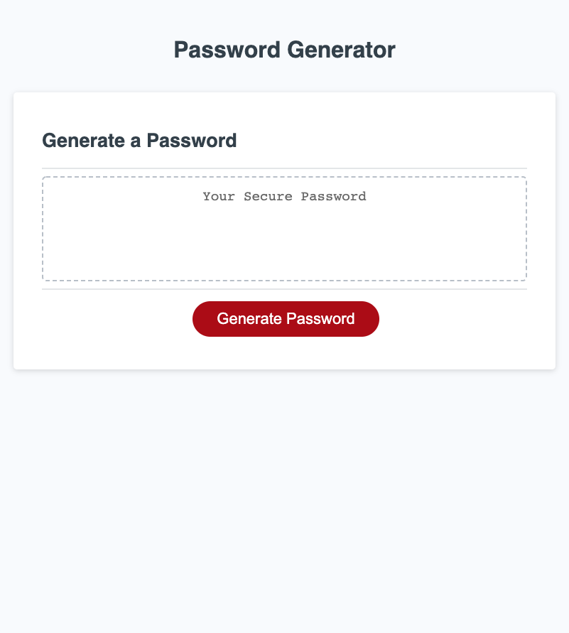

# Password Generator

Welcome to the README for my third project as a student of Coding Boot Camp at UCLA Extension: The password generator.

## Description

My third project is to flex my JavaScript muscle by developing a password generator. The password generator is supposed to provide the user with a completely random password. The user is prompted regarding the length of the password and if they would like it to include lowercase letters, uppercase letters, symbols and integers.

## Link

[Password Generator](https://seanc0ne.github.io/password-generator/)

## Screenshot

